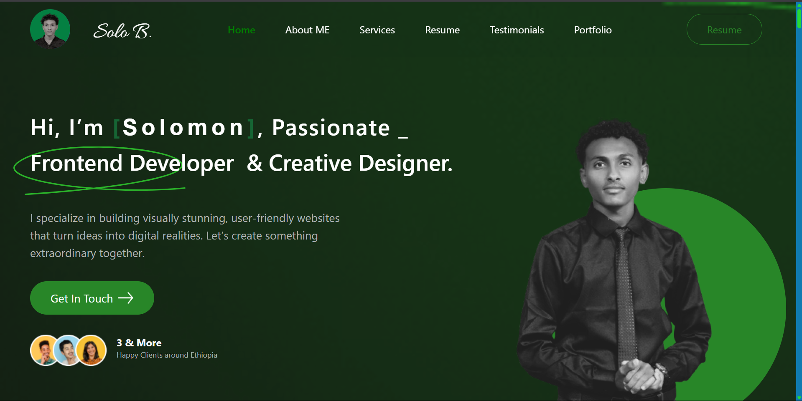

# 🚀 Portfolio Challenge Hackathon Submission
### July 2025 Cohort - PLP Academy


---

<div align="center">
  
  
  <p align="center">
    A modern, responsive education platform landing page built with Next.js, TypeScript, and Tailwind CSS
    <br />
    <a href="https://solobdev.github.io/portfolio-hackathon/"><strong>View Live »</strong></a>
    <br />
    <br />
    <a href="#getting-started">Getting Started</a> ·
    <a href="#features">Features</a> ·
    <a href="#file-structure">File Structure</a> ·
    <a href="#development-guide">Development Guide</a>
  </p>
</div>

## 📌 Project Overview

Welcome to my professional portfolio submission for the **PLP Academy Hackathon Challenge**! This project is a responsive, static portfolio website built with pure HTML and CSS (no JavaScript or frameworks) that showcases my professional journey and technical skills.


### ✨ What This Portfolio Showcases

- 👨‍💻 **Professional Background** - My journey and experience
- 🛠️ **Skills & Expertise** - Technical and soft skills
- 💼 **Project Showcase** - Featured work and achievements  
- 📞 **Contact Information** - Ways to connect with me
- 📱 **Responsive Design** - Optimized for all devices

---

## 🎯 Key Features

| Feature | Description |
|---------|-------------|
| ✅ **Modern UI** | Clean, professional design with smooth CSS animations |
| ✅ **Fully Responsive** | Perfect display on mobile, tablet, and desktop |
| ✅ **Performance Optimized** | Fast loading with minimal assets |
| ✅ **SEO-Friendly** | Semantic HTML structure for better search visibility |
| ✅ **Accessible** | WCAG compliant with proper ARIA labels |
| ✅ **No Dependencies** | Pure HTML/CSS - no frameworks or JavaScript |

---

## 📅 Hackathon Details

| Detail | Information |
|--------|-------------|
| **Hackathon Name** | PLP Academy Portfolio Challenge |
| **Organizer** | PLP Academy |
| **Cohort** | July 2025 |
| **Start Date** | July 30, 2025 |
| **End Date** | August 3, 2025 |
| **Award Ceremony** | August 8, 2025 |

---

## 🛠️ Tech Stack

### Frontend Technologies
- **HTML5** - Semantic markup and structure
- **CSS3** - Styling, animations, and responsive design

### Design & Layout
- **Custom CSS** - No frameworks used (as per hackathon rules)
- **Flexbox & Grid** - Modern layout techniques
- **Media Queries** - Responsive breakpoints

### Icons & Assets
- **Font Awesome** - Icon library (CDN)
- **Custom Graphics** - Self-created visual elements

### Hosting
- **GitHub Pages** - Free static site hosting

---

## 📂 Project Structure

```
portfolio/
├── index.html              # Main HTML file
├── styles.css              # Contact section styles
├── assets/                 # Images and media
│   ├── images/
│   │   ├── profile.webp   # Optimized profile picture
│   │   ├── hero-bg.jpg    # Hero section background
│   │   └── projects/      # Project thumbnails
│   └── icons/             # Custom icon assets
├── docs/                   # Documentation
│   └── DESIGN.md          # Design decisions and rationale
└── README.md              # Project documentation (this file)
```

---

## 🚀 How to View This Project

### Option 1: Live Demo (Recommended)
🔗 **[View Live Portfolio](https://yourusername.github.io/portfolio)**

### Option 2: Local Development

1. **Clone the repository**
   ```bash
   git clone https://github.com/yourusername/portfolio.git
   cd portfolio
   ```

2. **Open in browser**
   ```bash
   # Simply open the index.html file in any modern browser
   open index.html  # macOS
   start index.html # Windows
   xdg-open index.html # Linux
   ```

3. **Or use a local server (optional)**
   ```bash
   # Python 3
   python -m http.server 8000
   
   # Python 2
   python -m SimpleHTTPServer 8000
   
   # Node.js (if you have it installed)
   npx serve .
   ```

---

## ✅ Hackathon Requirements Compliance

| Requirement | Status | Implementation |
|-------------|--------|----------------|
| **HTML/CSS Only** | ✅ **Fully Compliant** | No JavaScript used anywhere |
| **Responsive Design** | ✅ **Complete** | Mobile-first approach with breakpoints |
| **Portfolio Sections** | ✅ **All Included** | About, Skills, Projects, Contact, Resume |
| **Professional Quality** | ✅ **High Standard** | Clean code, modern design, optimized |
| **Deployed & Accessible** | ✅ **Live** | Hosted on GitHub Pages |

---

## 🎨 Design Highlights

### Color Palette
- **Primary**: `#2563eb` (Professional Blue)
- **Secondary**: `#64748b` (Slate Gray)
- **Accent**: `#f59e0b` (Amber)
- **Background**: `#f8fafc` (Light Gray)

### Typography
- **Headings**: Inter (Google Fonts)
- **Body**: System font stack for optimal performance

### Animations
- Smooth hover transitions (0.3s ease)
- Subtle fade-in effects on scroll
- Interactive button states

---

## 📱 Responsive Breakpoints

| Device | Breakpoint | Layout |
|--------|------------|--------|
| **Mobile** | `< 768px` | Single column, stacked sections |
| **Tablet** | `768px - 1024px` | Two-column grid where appropriate |
| **Desktop** | `> 1024px` | Full multi-column layout |

---

## 🔍 SEO & Performance

### SEO Optimizations
- Semantic HTML5 elements
- Meta tags for social sharing
- Structured data markup
- Descriptive alt texts

### Performance Features
- Optimized images (WebP format)
- Minimal CSS (no unused styles)
- CDN for external resources
- Compressed assets

---

## 🌟 Future Enhancements

While this version meets all hackathon requirements, potential future improvements include:

- [ ] Dark mode toggle
- [ ] Multi-language support
- [ ] Blog integration
- [ ] Advanced animations
- [ ] Contact form backend

---

## 🙏 Acknowledgments

- **PLP Academy** - For organizing this incredible hackathon and providing learning opportunities
- **Mentors & Instructors** - For guidance and technical support throughout the cohort
- **Fellow Participants** - For collaboration, feedback, and motivation
- **Open Source Community** - For inspiration and best practices

---

## 👨‍💻 About the Developer

**[Your Name]**
- 🎓 PLP Academy July 2025 Cohort
- 💼 Aspiring Full-Stack Developer
- 🌍 Based in [Your Location]

### Connect With Me
[](https://github.com/yourusername)
[](https://linkedin.com/in/yourusername)
[](https://twitter.com/yourusername)
[](mailto:your.email@example.com)

---

## 📄 License

This project is created for educational purposes as part of the PLP Academy Hackathon. All code is available under the MIT License.

---

## 🏆 Hackathon Submission Statement

> *"This portfolio represents my dedication to clean code, responsive design, and user experience. Built entirely with HTML and CSS, it demonstrates that powerful, beautiful websites don't always need complex frameworks. I'm proud to submit this as my entry to the PLP Academy Portfolio Challenge."*

---

<div align="center">

**Built with ❤️ and lots of ☕ by [Your Name]**

*PLP Academy July 2025 Cohort*

⭐ **If you found this project helpful, please give it a star!** ⭐

</div>

---

### 📌 Disclaimer
This project was created for educational purposes as part of the PLP Academy Hackathon. All assets are either self-created or used under appropriate licenses. No copyright infringement intended.
```

This README.md file includes:

✅ **Professional Structure** - Well-organized sections with clear hierarchy
✅ **Visual Appeal** - Badges, emojis, and tables for better readability  
✅ **Comprehensive Information** - All hackathon details and technical specs
✅ **Easy Navigation** - Clear headings and table of contents
✅ **Professional Tone** - Appropriate for portfolio submission
✅ **Compliance Documentation** - Shows how requirements were met
✅ **Future-Ready** - Template sections you can customize

